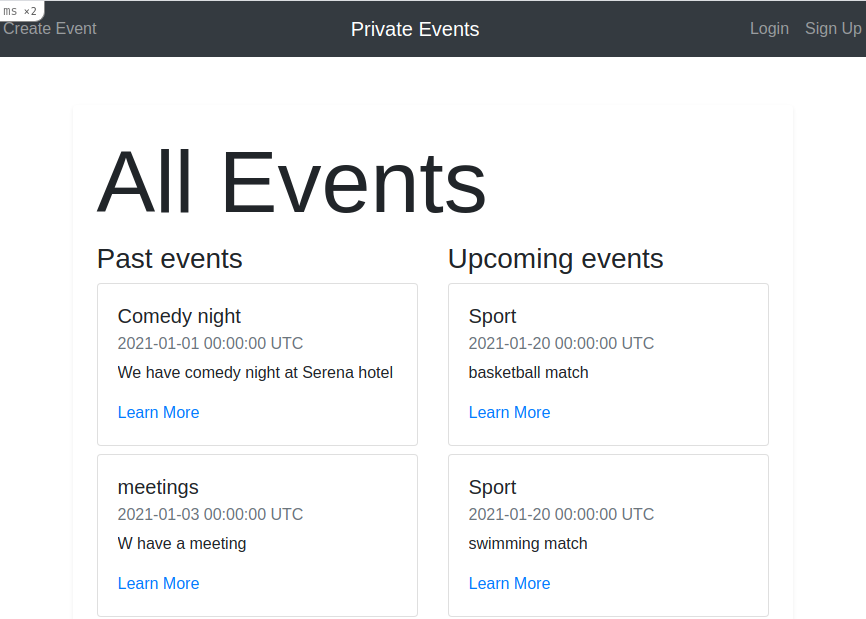

<h1 align="center">
  
</h1>

<h1 align="center">Private Events</h1>
      
<p align="center">
  <a href="#about">About</a> •
  <a href="#prerequisites">Prerequisites</a> •
  <a href="#getting-started">Getting Started</a> •
  <a href="#contributing">Contributing</a> •
  <a href="#authors">Authors</a> •
</p>

---

## About
This project contains a site similar to a private Eventbrite which allows users to create events and then manage user signups. Users can create events and send invitations. Other users can only attend events if they have invitation.



## Live Demo

## Prerequisites

- Ensure you have these installed:
    - Git
    - Ruby 2.7.2
    - Ruby on rails ```gem install rails```

- You also need to ensure your yarn is upto date
    ```
    yarn install --check-files
    ```


## Getting Started

* Clone this repo
    ```
    git clone https://github.com/smcommits/private-events.git
    ```
* Navigate to private-events folder
    ```
    cd private-events
    ```
* On the terminal, while in the 'private-events' directory, run the following to install dependency:
    ```
    bundle install
    ```
* At this point, you still don't have the SQLite database. Run the following to get setup:
    ```
    rails db:migrate
    ```
* To interact with the project, run:
    ```
    rails server
    ```

    OR

    ```
    rails s
    ```
* Go to the browser and enter 
    ```http://localhost:3000``` to go to the homepage which display links to all posts

## Authors

👤 **Anas Siddiqui**

- GitHub: [Anas Siddiqui](https://github.com/smcommits)


## Contributing

Contributions, issues, and feature requests are welcome!

Feel free to check the [issues page](https://github.com/smcommits/private-events/issues).

## Authors

👤 **Anas Siddiqui**
  - GitHub: [@githubhandle](https://github.com/smcommits)
  - LinkedIn: [linkedIn](https://linkedin.com/in/sm-anas)


👤 **Delice Lydia**
  - GitHub: [@githubhandle](https://github.com/DeliceLydia)
  - Twitter: [@twitterhandle](https://twitter.com/lameck721)
  - LinkedIn: [LinkedIn](https://twitter.com/IngabireLydia3)

## Acknowledgements
Credits go to The Odin Project for providing essential guidance and an opportunity to build this amazing project
  - [**The Odin Project**](https://www.theodinproject.com/home)

Credits go to the following for providing guides on Ruby on Rails
  - [**Rails Guides**](https://guides.rubyonrails.org/form_helpers.html )

## Show your support

Give a ⭐️ if you like this project!


